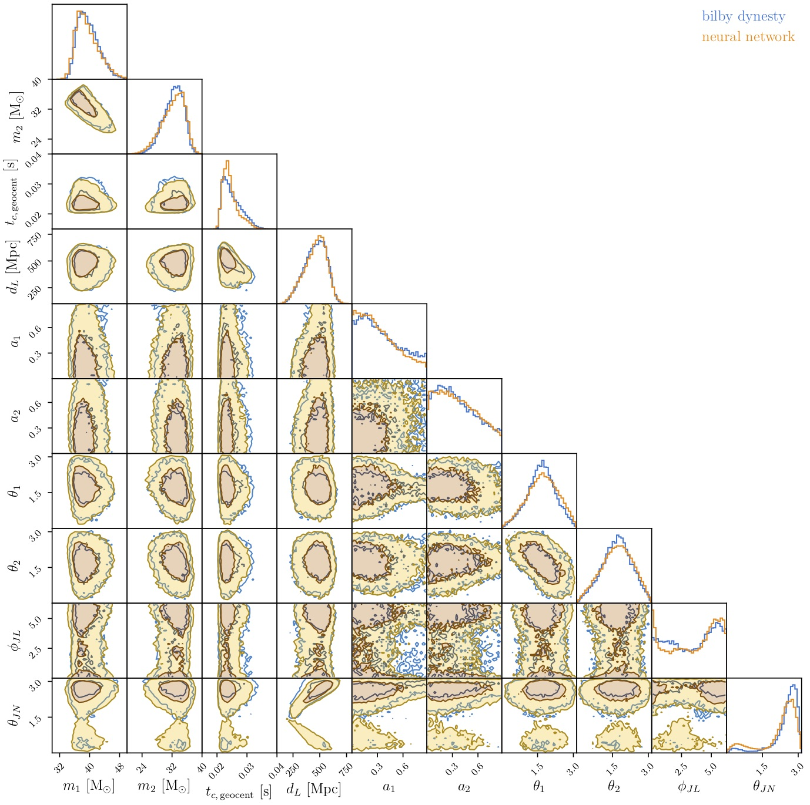
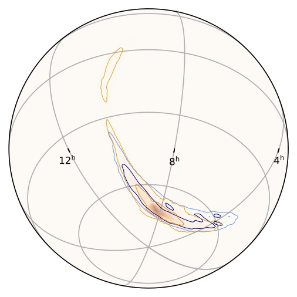

# Complete parameter inference for GW150914 using deep learning

## lfigw: Likelihood-Free Inference for Gravitational Waves

----

This repository contains the code for the paper [arXiv:2008.03312](https://arxiv.org/abs/2008.03312), by Stephen R. Green and Jonathan Gair.

The aim of this work is to train a neural-network conditional density estimator to approximate the Bayesian posterior for compact binary system parameters given detector strain data. We use the method of normalizing flows to learn a mapping between a multivariate standard normal base space and the system parameter space. This mapping is conditional on the strain data.

This is the first successful application of deep learning to perform inference over the full 15-dimensional space of quasi-circular binary black hole parameters, using real strain data from multiple detectors, and taking into account realistic noise properties. We demonstrated this by analyzing data from the first gravitational-wave detection, [GW150914](https://en.wikipedia.org/wiki/First_observation_of_gravitational_waves).

This code uses the [nflows](https://github.com/bayesiains/nflows) package to implement the normalizing flow, which we take to be a [neural spline](https://arxiv.org/abs/2002.03712) flow. It makes use of the [PyTorch](https://pytorch.org) machine learning framework.

## Setup

Create and activate a `conda` environment with the correct software dependencies:

    conda env create -f environment.yml
    conda activate gwml

## Usage

### Training

1. **Download event data (optional).**

    To perform inference on real data, download the strain data for the event and estimate the noise power spectral density (PSD) just prior to the event. At present, the network must be tuned to the detector noise characteristics at the time of the event.

    I have already done this for GW150914, with the event information placed in [data/events/GW150914/](data/events/GW150914/). This contents of this directory were generated by the code in [notebooks/GW150914_data.ipynb](notebooks/GW150914_data.ipynb). For training the network, only PSD information will be used, but this directory also contains the strain data to be analyzed at inference time.

2. **Generate training set.**

        python generate_waveforms.py

    This will generate a dataset of 10^6 sets of intrinsic parameters drawn from the prior, and associated plus and cross waveform polarizations. It defaults to the `IMRPhenomPv2` waveform model, but all of these settings can be changed. (Note: only the neural spline flow option will work; CVAE and MAF options exist, but are currently deprecated.) Waveforms are saved in a reduced-order representation using a singular value decomposition.

    The waveform dataset is stored in [waveforms/GW150914/](waveforms/GW150914/). This also contains information about transforming to the reduced-order representation.

    The training dataset only depends on the event data insofar as it sets parameters such as the sampling rate and waveform duration to match the data segment. The PSD information is also used to generate noise realizations and the trigger time is used to project signals onto detectors at train time.

3. **Train the network.**

        ./train_nde.sh

     This constructs the neural network model and trains for 500 epochs. Network hyperparameters and training options can be specified by modifying this script.

     For each epoch, it takes the saved waveform polarizations, samples random extrinsic parameters and noise realizations using the PSD estimated in step 1, and generates the artificial detector strain data. By sampling extrinsic parameters at train time, we effectively enlarge the size of the training set.

     The trained model is stored in [models/GW150914/](models/GW150914/).

### Inference

To perform inference, execute the code in the notebook [notebooks/nde_evaluation_GW150914.ipynb](notebooks/nde_evaluation_GW150914.ipynb). This loads the strain data for GW150914 and conditions the trained normalizing flow on them. It draws samples from the base space, and applies the flow to generate samples from the conditional density estimator.

Note that that this performs a comparison against `bilby` samples. For this to work, a `bilby` run must be performed as well.

## Comparison to standard samplers

In our paper, we compared the results of the neural-network model to the `dynesty` sampler using `bilby`. To run this sampler with the same data conditioning as the neural network, run

    cd bilby_runs/
    python bilby_script.py

## Results

The resulting posterior distributions for GW150914 can be compared, and we see that they are in good agreement:

## Contact

For any questions or issues with the code, please contact me at stephen.green@aei.mpg.de.
